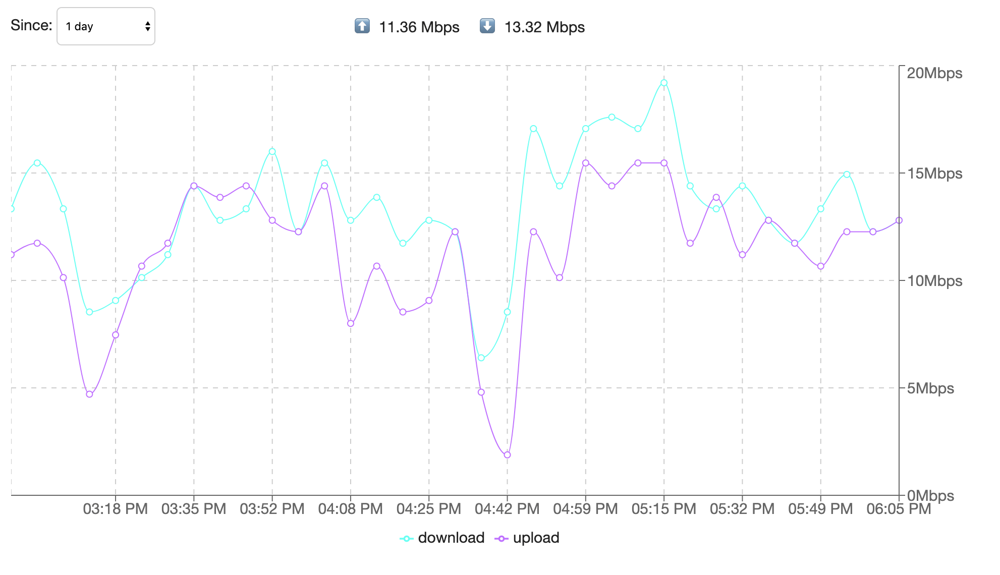
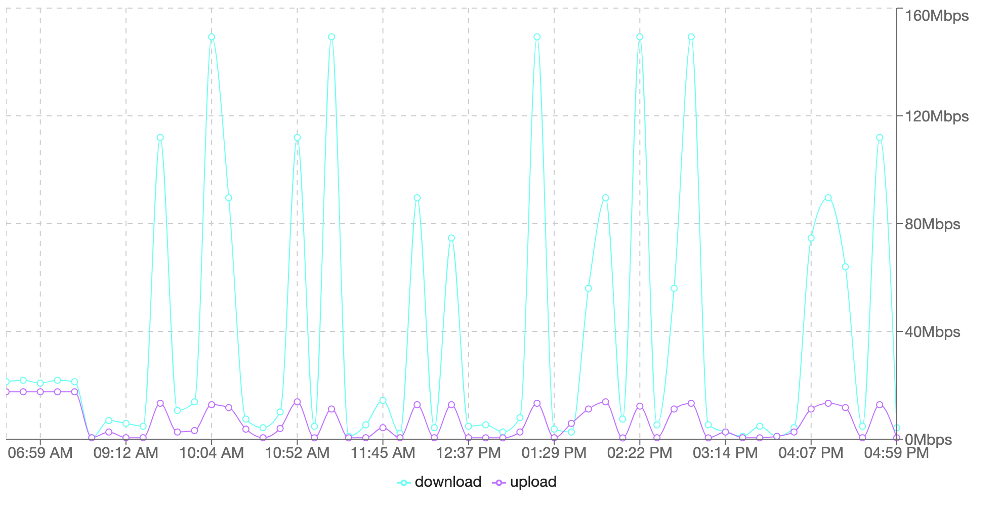

# ISPMON


Your persistent ISP bandwidth monitor.



As a software engineer who relies on [managed dependencies](https://i.redd.it/tfugj4n3l6ez.png), the least of your 
concerns SHOULD be the managed dependencies. This is not the case in the [country I am living in](https://www.rappler.com/technology/news/171680-philippines-akamai-broadband-adoption-internet-speed-rankings).

I am currently subscribed to my [ISP's fiber connection offering](https://www.convergeict.com/fiber-x/). It promises 
no data cap, maxed at 25Mbps, but with a teeny tiny asterisk that says:

> 30% minimum speed at 80% service reliability.

Then came that night, when our internet speed dropped down to 1Mbps. I could've tolerated it if it only 
happened rarely. But it happened consistently at certain times of the day, and it made me realize that 
they _might_ be throttling connections at **specified times of the day**.

To track that down (and soon nag about it), I started this project.

## Running

You can download the jar from the [releases](https://github.com/devcsrj/ispmon/releases), and run it with:

```shell script
$ java -jar ispmon-1.0.0.jar
```

Or, if you're like me, who loves running applications on [Docker](https://www.docker.com):

```shell script
$ docker run -p 5000:5000 -t -d --name ispmon devcsrj/ispmon:1.0.0
```

Configuration options below can be overridden with the `--env` argument. In addition, results 
are stored in a directory called `results`. To persists the results across container restarts, 
configure the volume. For example:

```shell script
docker run -p 5000:5000 -t -d --volume /path/in/host:/opt/results --name ispmon devcsrj/ispmon:1.0.0
```

## Configuring

The application reads the following from the environment variables:

* `ISPMON_INTERVAL=15` - (minutes) the interval at which, speed test should be done
* `ISPMON_DURATION=30` - (seconds) the maximum time to conduct speed tests
* `ISPMON_PORT=5000` - the port to run the web server
* `TZ` - to set [the timezone](https://en.wikipedia.org/wiki/List_of_tz_database_time_zones)

---

## Developing

### Prerequisites

- JDK 8

**Tip**: Use [sdkman](https://sdkman.io/install).

```shell script
$ sdk install java 19.2.0-grl
```

### Backend

To run the server:

```shell script
$ ./gradlew run
```

It will then start a server at port `5000`.

### Frontend

The frontend resides under `src/main/frontend`. It also expects that the 
backend is running at port [5000](src/main/frontend/webpack.config.js).

```shell script
$ cd src/main/frontend
$ yarn run start
```

This will start the webpack server at port `5001`.

### Building

To build a `jar`:

```shell script
$ ./gradlew build
```

You can then run this with `java -jar build/lib/ispmon-$version.jar`.

---

## FAQ

* Have you tried switching to another ISP?

    Well, there's another [ISP here](https://pldthome.com/fibr), but I'd argue it's not any better. At 
    work, I ran `ispmon` to see the results for comparison. I am staggered:



* Did you really have to go this far?

    I also needed an excuse to play with new shiny things. This is my first project that involved:
    
    - ~~The ultra-fast and lean Vertx~~
    - The coroutine-powered [Ktor](https://ktor.io)
    - The well-loved [React](https://reactjs.org)
    - The smart bundler [webpack](https://webpack.js.org)
    - ~~and the bleeding edge Graal Native Image~~
